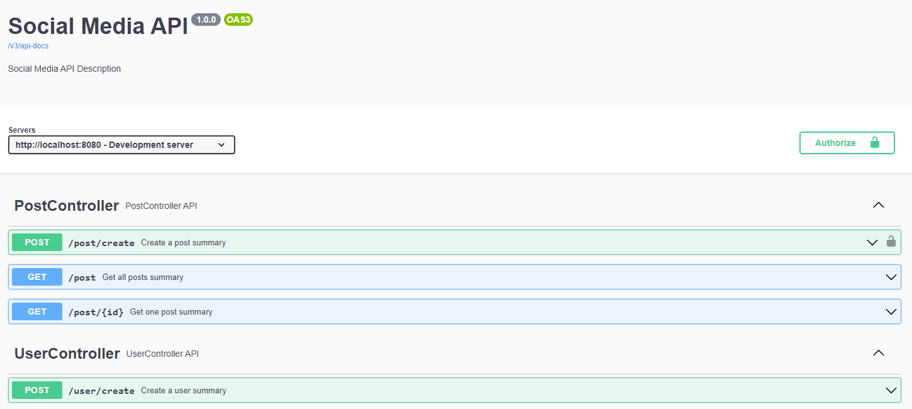
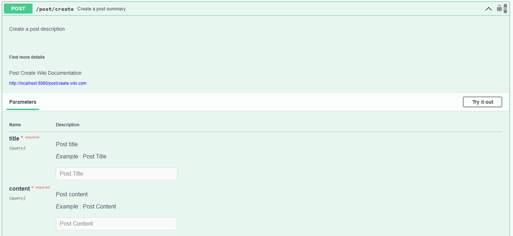
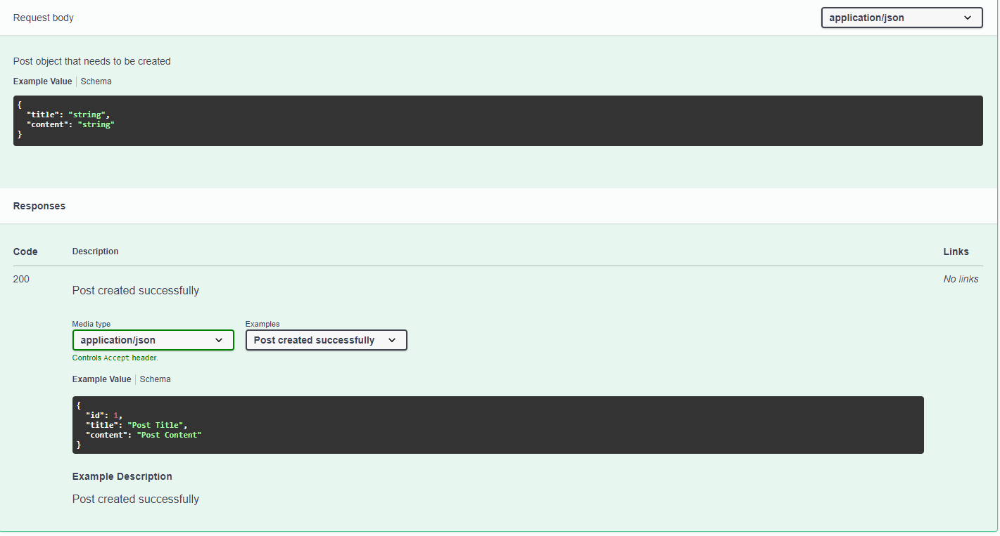
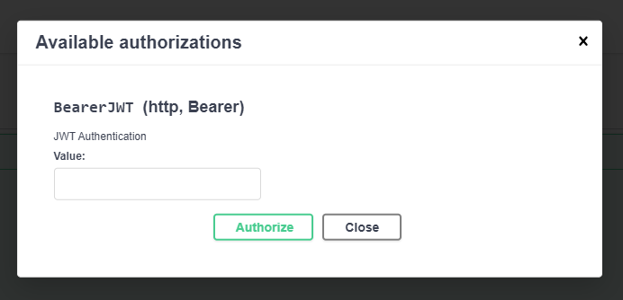

# Spring Boot Open API Implementation

This project is a sample implementation of Open API 3.0 using Spring Boot.

## Technologies
- Java 17
- Spring Boot 3.1.1
- Springdoc Open API Webmvc UI 2.1.0

## Screenshots

## Resources

- https://springdoc.org/
- https://lemoncode21.medium.com/how-to-add-openapi-and-swagger-in-spring-boot-3-7c8d4dbc1f6e
- https://github.com/moaaz-nashawi/swagger-crash-course